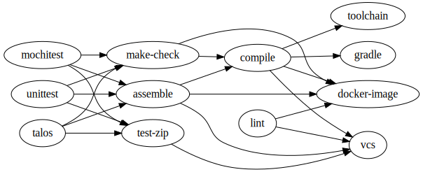

# tl;dr

The task graph is built by linking different kinds of tasks together, pruning out tasks that are not required,
then optimizing by replacing subgraphs with links to already-completed tasks.

# Concepts

* *Task Kind* - Tasks are grouped by kind, where tasks of the same kind do not have interdependencies but have
  substantial similarities, and may depend on tasks of other kinds.  Kinds are the primary means of supporting
  diversity, in that a contributor can add a new kind to do just about anything without impacting other kinds.
* *Task Attributes* - Tasks have string attributes by which they can be queried and filtered.
* *Task Labels* - A unique identifier for the task within the graph that is stable across runs of the graph
  generation algorithm.  Labels begin with `<kind>/`.  Labels are replaced with TaskCluster TaskIds at the
  latest time possible, preventing spurious taskId changes in diffs made before that time.
* *Query Language* - A simple means of selecting subsets of tasks based on attributes.  Similar in principal
  to the [Bazel Query Language](http://bazel.io/docs/query.html).
* *Optimization* - replacement of a task in a graph with an equivalent, already-completed task, or a null
  task, avoiding repetition of work.

# Graph Generation Process

1. For all kinds, generate all tasks.  The result is the "full task set"
1. Create links between tasks using kind-specific query expressions.  The result is the "full task graph".
1. Select the target tasks (based on try syntax or a tree-specific specification).  The result is the "target
   task set".
1. Based on the full task graph, calculate the transitive closure of the target task set.  That is, the target
   tasks and all ancestors of those tasks.  The result is the "target task graph".
1. Optimize the target task graph based on kind-specific optimization methods.  The result is the "optimized task graph".
1. Generate taskIds for all tasks in the optimized task graph.  Publish the full task graph with these taskIds included.
1. Create tasks for all tasks in the optimized task grap.

# Mach commands

* `mach taskgraph tasks <query>` -- get a subset of the taskset based on the query, sorted by label.
  This is useful for making diffs to see the effects of a change to task definitions.
* `mach taskgraph full` -- generate the full task graph, including dependency links.
  This is also useful for diffs, and for visualization.
* `mach taskgraph target <expr>` -- get the target task graph, based on the given expression.
  The expression can be try syntax, `--project` to specify a project, or a query.
* `mach taskgraph optimized [<expr>]` -- get the optimized task graph, optionally based on the target graph for `<expr>`.
* `mach taskgraph visualize` -- generate a visualization of the given graph (maybe in `.dot` format?)
* `mach taskgraph decision` -- run the whole task-graph generation process (expects to be run in a decision task)

# Hypothetical Kind Graph

